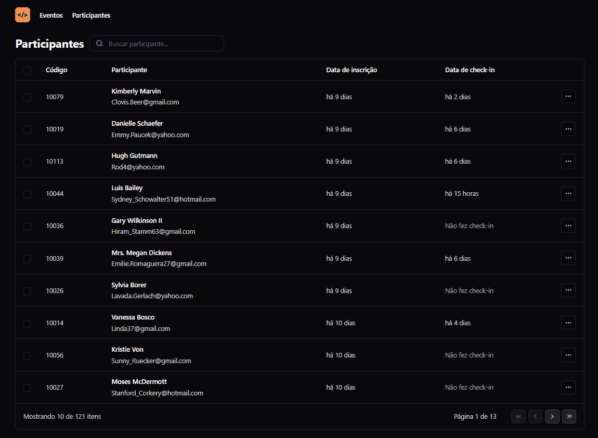

# 📋 NLW Unite | Pass In Web

## Tabela do Conteudo

<ul>
    <li><a href="#descrição-do-projeto">Descrição do projeto</a></li>
    <li><a href="#instalação">Instalação</a></li>
    <li><a href="#objetivo">Objetivo</a></li>
    <li><a href="#resumo">Resumo</a></li>
        <ul>
            <li><a href="#">Observação</a></li>
            <li><a href="#">Aprendizado</a></li>
        </ul>
    <li><a href="#status">Status</a></li>
    <li><a href="#tecnologias">Tecnologias</a></li>
</ul>

## Descrição do projeto

Este é um projeto da [NLW Unite](https://www.rocketseat.com.br/) apresentado em três aulas, em cada aula pude conhecer vários conteúdos e aprender na prática como funciona.

### Layout do projeto

## Instalação

Para executar o projeto na sua máquina, certifique-se de ter o Node.js instalado. 
Versão do Node utilizada 20.11.0.

Siga estas etapas:

1. Clone o repositório.
2. Navegue até o diretório do projeto.
3. Execute npm install para as dependências.
4. Execute npm run dev executar a aplicação.

## Objetivo

Busco constantimente absorver o máximo de conteúdo possível, fazer anotações, rever as aulas e praticar bastante para aprimorar meus conhecimentos de código nessa tecnologia.

## Resumo

<li>NLW Unite | Aula 01

#### Observação: 🔍

        Nesta aula pude conhecer mais sobre o projeto e sua utilidade, também mais sobre os fundamentos do react para criar uma boa base sólida desse projeto. 
        O projeto inclui gerenciar participantes e visualizar quem já confirmou o seu check-in!

#### Aprendizado: 💡

        O TypeScript é uma ferramenta essencial para todo desenvolvedor de sucesso, trazendo uma tipagem estática, para que cada função do código receba restritamente a informação que está sendo passada. Quando se usa TypeScript toda função do código precisa declarar o formato dos parâmetros que essa função recebe.
    
        Utilização prática de estilização com o Tailwind, trazendo padronização nos estilos e mais produtividade. 
    
        Como utilizar o método Array.from() do JavaScript para criar várias linhas de código repetidamente.

        Reforcei meu conhecimento sobre componentes onde são funções que retornam o HTML e as propriedades!
    

<li>NLW Unite | Aula 02

#### Observação: 🔍

    Nesta aula pude reforçar meus conhecimentos em estados do react, que são as variáveis que estão sendo observadas e sempre que há uma alteração ela é novamente renderizado, navegações de páginas utilizados métodos do JavaScript como slice() and map() e novas bibliotecas do react.

#### Aprendizado: 💡

        Utilizando a propriedade children do react para buscar o valor que está entre a tag do component que foi criado.

        Extender elementos nativos do HTML para um component com o ComponentProps.

        Separar uma propriedade personalizada de toda lista de propriedades que se encontra dentro de um operador.

        Quando tentamos passar uma className a um component na qual ele já esteja retornando um className, essa nova atribuição de className no component vai se substituir, para isso podemos Biblioteca do Tailwind, o tailwind-merge, que vai servir para unir essas classes com o twMerge.

        Utilizar fakerjs para criar uma variedade de dados ffictícios.

        Day-js para formatar datas no react e configurar há quantos dias atrás o attendee realizou o cadastro e o check-in. 

<li>NLW Unite | Aula 03

#### Observação: 🔍

        Nesta aula pude conhecer um exemplo de um banco de dados desenvolvido com a tecnologia de nodejs pela NLW Unite, onde irei utiliza-lá para conectar ao meu projeto de Pass In Web.

#### Aprendizado: 💡

        Conhecendo um pouco mais sobre como utilizar o TypeScript, tipando um estado com as configurações de um array de objetivos. 

        Conheci vários conceitos importantes do funcionamento da URL State, para armazenar na url da aplicação um estado, para o usuário poder salvar a página que está navegando e o valor do input no campo de busca, podendo até compartilhar o link. Uma boa prática na qual muitos aplicações não utilizam, como diz o professor da aula Diego Fernandes, "Persistir as opções de inputs do usuário na URL".
    
## Status

Etapa 3/3 concluída! ✨🎉

Versão mobile temporariamente indisponível!⏱

## Tecnologias

<ul>
    <li>HTML</li>
    <li>CSS</li>
    <li>JavaScript</li>
    <li>React</li>
    <li>TypeScript</li>
    <li>Tailwind</li>
</ul>

### Bibliotecas adicionais

<ul>
    <li>Lucide</li>
    <li>Tailwind Merge</li>
    <li>Day Js</li>
</ul>

### Plugin

forms -> tailwindcss